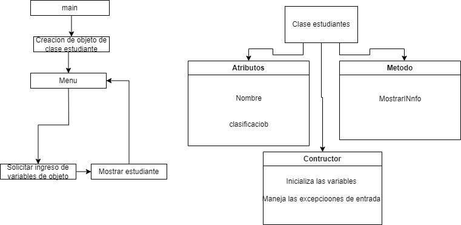

# Diagrama de Bloques

## Explicacion

### Primer paso
Primero se creara la clase estudiandes, esto incluye su cpp y su header

### Segundo paso

Creacion del main, con este se hara el menu. El mismo tendra el manejo de excepciones.