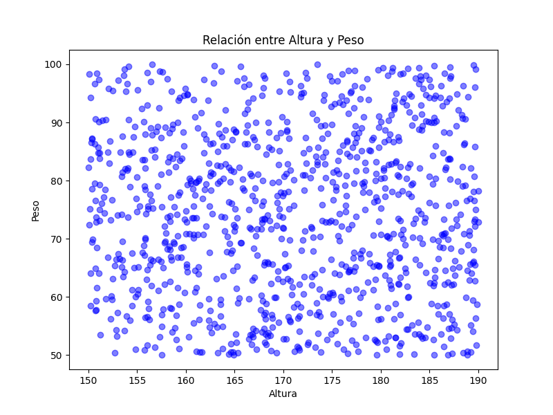
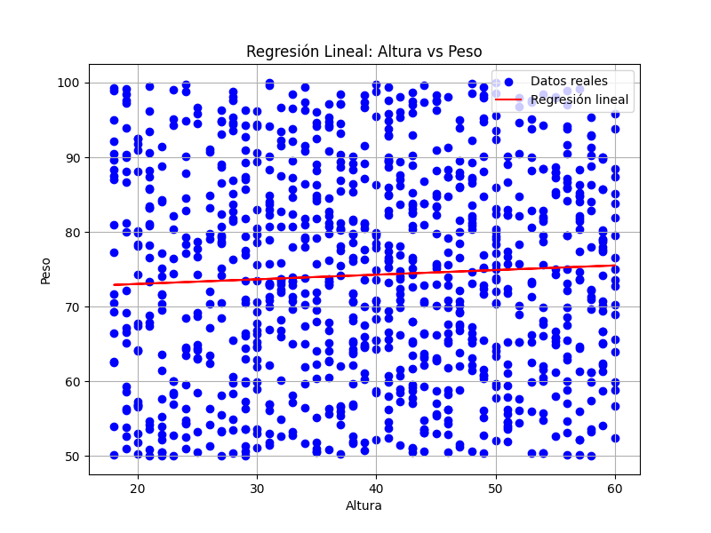
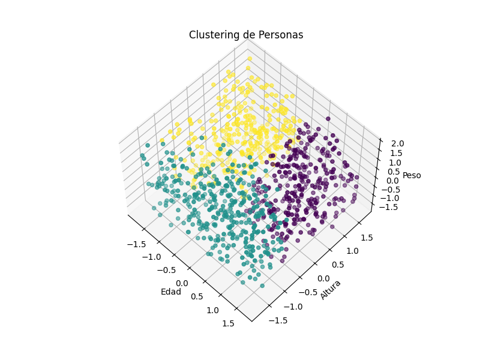

# Examen Final
## Noel Blandon Saborio   -    B61097

### Item 1

En programación orientada a objetos, la herencia es que una clase herede atributos y métodos de otra. La clase que hereda se conoce como la clase hija, y la clase de la que se hereda se conoce como la clase padre. Por ejemolo. El data set dado puede ser para una base de datos de una escuela, el cual puede tener dos clases una de persona y otra clase hija de esta que se llame estudiante que proporciona el grado y hereda los demas atributos de la clase padre. Ejemplo:
 
### Item 2

```
# Clase Padre 
class Persona:
    def __init__(self, edad, altura, peso, mano_dominante, genero):
        self.edad = edad
        self.altura = altura
        self.peso = peso
        self.mano_dominante = mano_dominante
        self.genero = genero
    

    def mostrar_informacion(self):
        print(f"Edad: {self.edad}, Altura: {self.altura}, Peso: {self.peso}, Mano Dominante: {self.mano_dominante}, Género: {self.genero}")

        
# Clase estudiante
class estudiante(Persona):
    def __init__(self, edad, altura, peso, mano_dominante, genero, ManoDominante):
        super().__init__(edad, altura, peso, mano_dominante, genero)
        self.ManoDominante = ManoDominante       
```

### Item 3 

Los decoradores en Python son útiles para modificar o extender el comportamiento de funciones o métodos sin cambiar su código fuente. Un caso común para utilizar un decorador es en el manejo de excepciones, donde se puede aplicar un decorador para atrapar excepciones específicas y manejarlas de una manera uniforme en varias funciones. Ejemplo cuando no se puede leer unarchivo.

``` 
def manejar_excepcion_lectura_csv(func):
    def wrapper(*args, **kwargs):
        try:
            # Intentamos ejecutar la función que lee el archivo CSV
            return func(*args, **kwargs)
        except pd.errors.EmptyDataError:
            print("El archivo está vacío o no se pudo encontrar.")
        except pd.errors.ParserError:
            print("Error al analizar el archivo CSV.")
        except FileNotFoundError:
            print("El archivo no pudo ser encontrado.")
        except pd.errors.DtypeWarning:
            print("Advertencia de tipo de datos al leer el archivo.")
    return wrapper
```

### Item 4

Utilizar with, se crea un contexto de ejecución que garantiza que los recursos se abran al entrar al bloque y se cierren automáticamente al salir, incluso si ocurren excepciones dentro del bloque.

``` 
try:
    with open('ejemplo.txt', 'r') as archivo:
        contenido = archivo.read()
        print(contenido)
except FileNotFoundError:
    print("El archivo no pudo ser encontrado.")
```

### Item 5
```
dataframe = pd.read_csv('conjunto_datos11931799.csv')

filas_mayores_30 = dataframe[dataframe['Edad'] > 30]
print(filas_mayores_30)
```

### Item 6

```
plt.figure(figsize=(8, 6))  # Tamaño del gráfico
plt.scatter(dataframe['Altura'], dataframe['Peso'], color='blue', alpha=0.5)
plt.title('Relación entre Altura y Peso')  # Título del gráfico
plt.xlabel('Altura')  # Etiqueta del eje x
plt.ylabel('Peso')  # Etiqueta del eje y
plt.show()  # Mostrar el gráfic
```


### Item 7

- Se puede utilizar para predecir valores futuros o estimar valores desconocidos a partir de datos existentes.

- Facilita entender y comprobar la relación entre variables.

- Permite analizar y comprender tendencias o patrones en los datos.

Por Ejemplo. Con el siguiente codigo buscamos la relacion entre la Edad Y el preso.

```
X = dataframe[['Edad']]  # Variable independiente (predictor)
y = dataframe['Peso']  # Variable dependiente (objetivo)

X_train, X_test, y_train, y_test = train_test_split(X, y, test_size=0.2,
                                                    random_state=42)

# Crear y entrenar el modelo de regresión lineal
modelo = LinearRegression()
modelo.fit(X_train, y_train)

# Realizar predicciones con el conjunto de prueba
predicciones = modelo.predict(X_test)

# Graficar la regresión lineal
plt.figure(figsize=(8, 6))

# Graficar datos reales
plt.scatter(X, y, color='blue', label='Datos reales')

# Graficar la regresión lineal
plt.plot(X_test, predicciones, color='red', label='Regresión lineal')
plt.title('Regresión Lineal: Altura vs Peso')
plt.xlabel('Altura')
plt.ylabel('Peso')
plt.legend()
plt.grid(True)
plt.show()

```

Da el siguiente Resultado



### Item 8

El clustering es una técnica de aprendizaje no supervisado que se utiliza para agrupar un conjunto de datos en grupos o clústeres, donde los elementos dentro de cada grupo son más similares entre sí que con los elementos de otros grupos. 

Por ejemplo se quiere agrupar en 3 gurpos las personas dependeiendop de su edad, altura y peso. Este es el codigo:

```
# Seleccionar características relevantes para el clustering
features = dataframe[['Edad', 'Altura', 'Peso']]


scaler = StandardScaler()
features_scaled = scaler.fit_transform(features)

# Aplicar el algoritmo de K-Means para agrupar a las personas en k clústeres
k = 3  # Número de clústeres (puedes ajustar este valor)
kmeans = KMeans(n_clusters=k, random_state=42)
dataframe['Cluster'] = kmeans.fit_predict(features_scaled)

# Visualizar los clústeres en un gráfico 3D
fig = plt.figure(figsize=(8, 6))
ax = fig.add_subplot(111, projection='3d')

ax.scatter(features_scaled[:, 0], features_scaled[:, 1], features_scaled[:, 2],
           c=dataframe['Cluster'], cmap='viridis')
ax.set_xlabel('Edad')
ax.set_ylabel('Altura')
ax.set_zlabel('Peso')
ax.set_title('Clustering de Personas') 

```

Y los grupos de manera grafica se ven de la siguiente manera:


